<h1 align="center">Welcome to Ms.Movie 👋</h1>
<p>
  <a href="https://github.com/chloe-codes1/Ms.Movie#readme" target="_blank">
    
  </a>
  <a href="https://github.com/chloe-codes1/Ms.Movie/blob/master/LICENSE.md" target="_blank">
    
  </a>
</p>

> :film_strip: Community for movie lovers

<br>

### 🏠 [Explore Ms.Movie](http://ec2-3-34-185-6.ap-northeast-2.compute.amazonaws.com/)

<br>

## Tech Stack

### Backend

- Django `3.0.7`
- django-rest-auth `0.9.5`
- djangorestframework `3.11.0`
- django-allauth `0.42.0`
- mysqlclient `1.4.6`

### Frontend

- Vue  `2.6.11`
- Vuex  `3.4.0`
- vue-cookies `1.7.0`
- vue-router `3.2.0`
- vue-infinite-scroll `2.0.2`
- axios  `0.19.2`
- bootstrap `4.5.0`
- bootstrap-vue `2.15.0`

### Database

- MySQL  `14.14`

### SCM

- Git  `2.17.1`

### Deployment

- AWS EC2

<br>

## Overview

<br>

> Signup

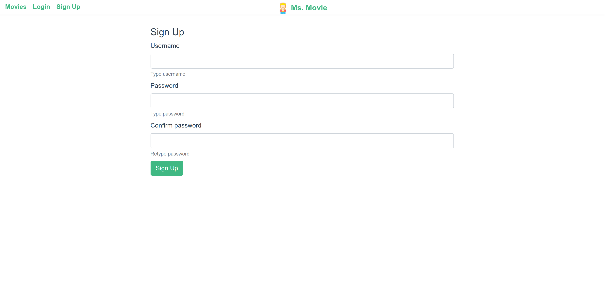

> Select favorite genre

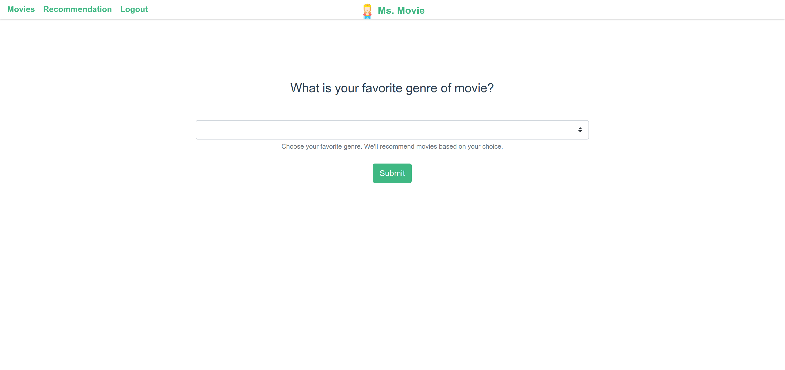


> Login

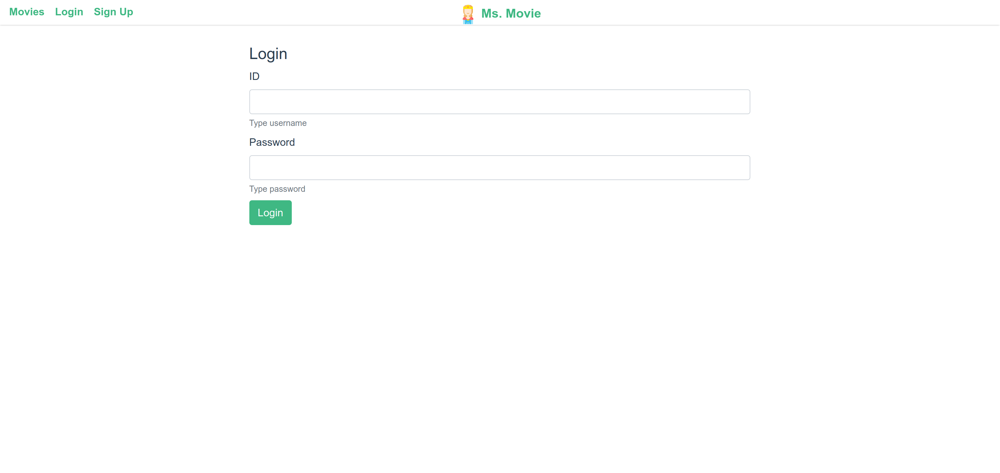

> Movie Recommendation

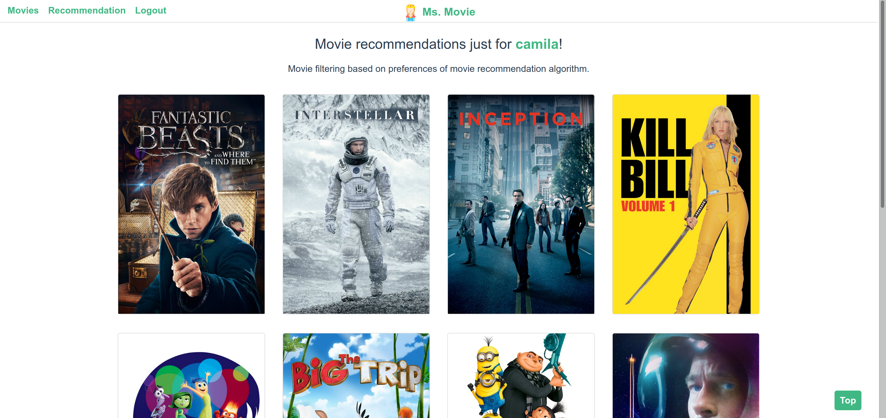

<br>

> Movies


<br>

> Search

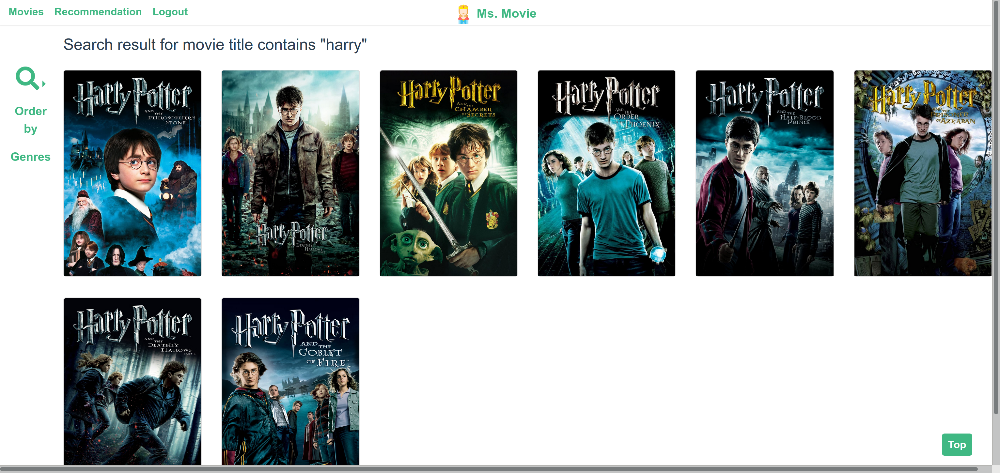

<br>

> Movie detail -1

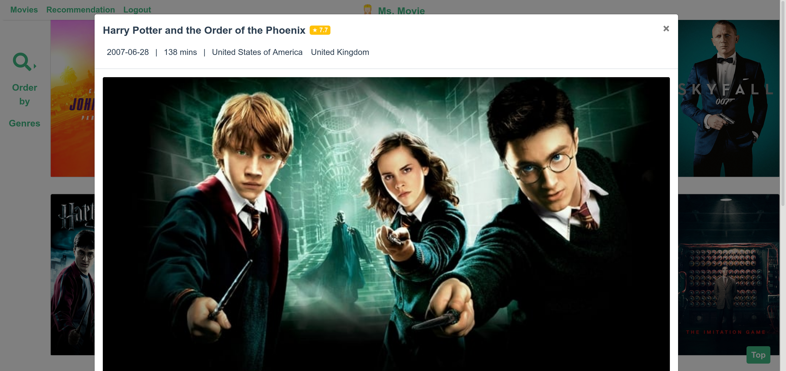

<br>

> Movie detail -2

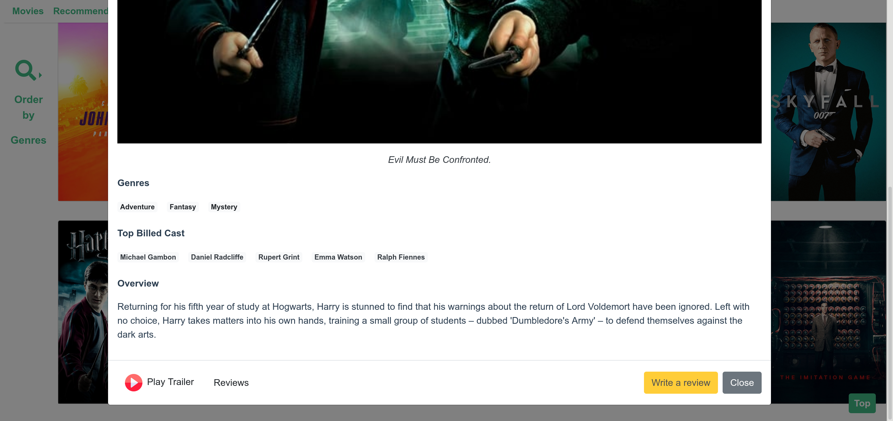

<br>

> Trailer


<br>

> Write a review

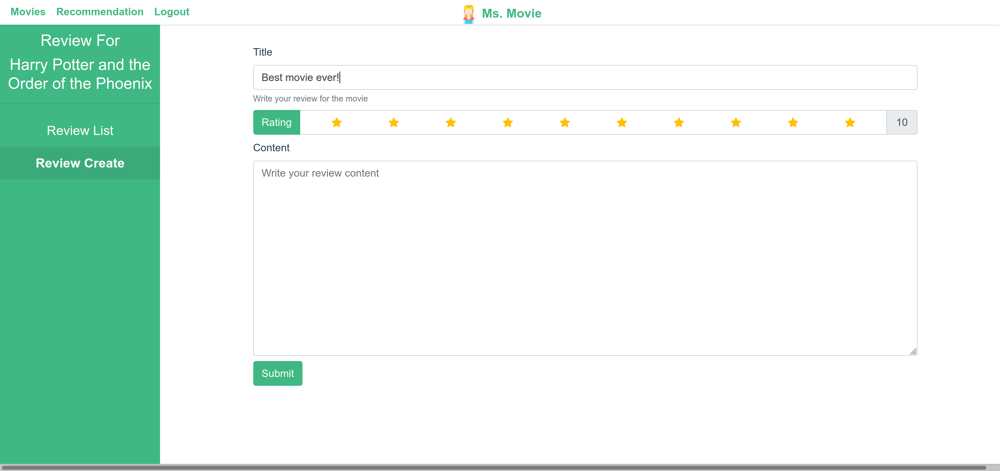

<br>

> Review Detail

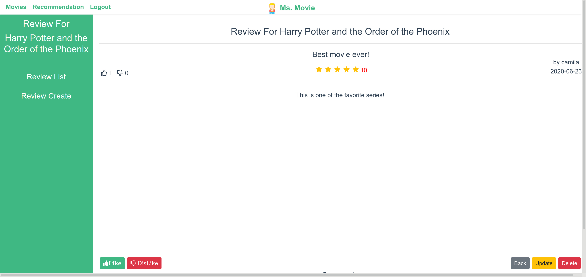

<br>

> Comment

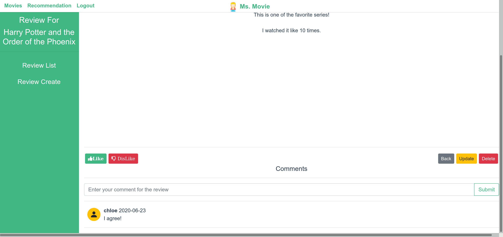

<br>

> Cast info

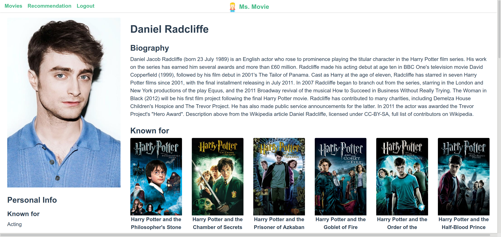

<br>

<br>

## Install

### Backend

```bash
$ cd backend
$ python install -r requirements.txt
$ python manage.py migrate
```

### Frontend

```sh
$ cd frontend
$ npm install
```

<br>

## Usage

### Backend

```bash
$ cd backend
$ python manage.py runserver
```

### Frontend

```sh
$ cd frontend
$ npm run serve
```

## Run tests

```sh
$ cd frontend
$ npm run test
```

<br>

<br>

## Author

👤 **Chloe**

* Website: https://chloe-codes1.gitbook.io/til
* Github: [@chloe-codes1](https://github.com/chloe-codes1)
* LinkedIn: [@juhyun-kim](https://www.linkedin.com/in/juhyun-kim-7a49661a1/)

<br>

👤 **Jisu**

- Github: [@Jisu5](https://github.com/Jisu5)

<br>

<br>

## 🤝 Contributing

Contributions, issues and feature requests are welcome!<br />Feel free to check [issues page](https://github.com/chloe-codes1/Ms.Movie/issues). 

<br>

<br>

## Show your support

Give a ⭐️ if this project helped you!

<br>

<br>

## 📝 License

Copyright © 2020 [chloe-codes1](https://github.com/chloe-codes1).<br />
This project is [MIT](https://github.com/chloe-codes1/Ms.Movie/blob/master/LICENSE.md) licensed.

***
_This README was generated with ❤️ by [readme-md-generator](https://github.com/kefranabg/readme-md-generator)_